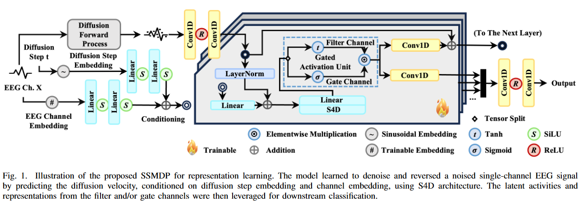
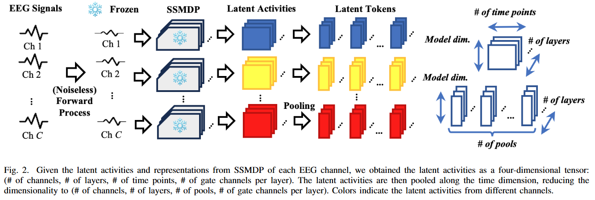
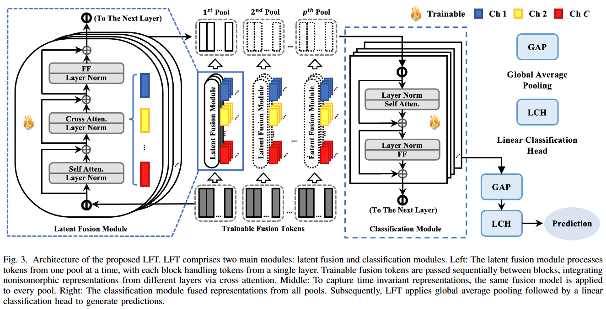
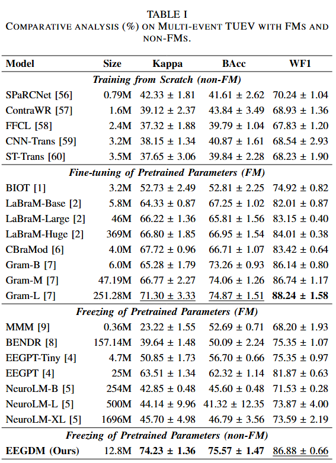
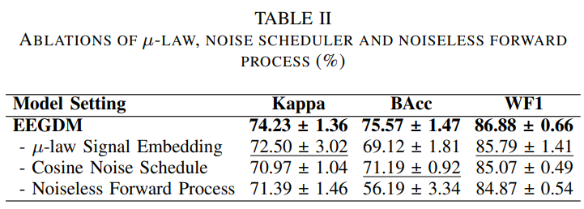
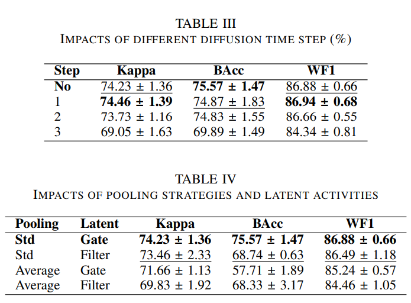
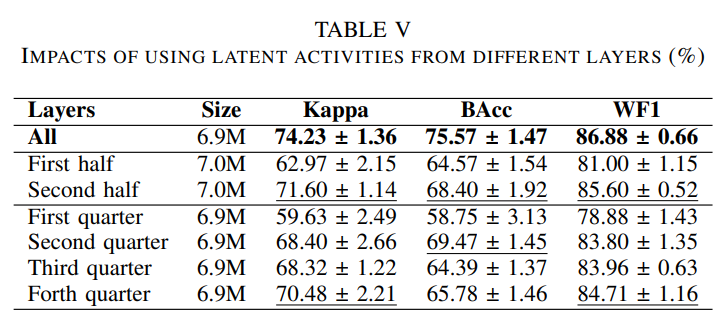
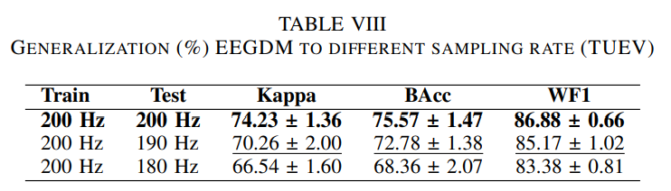
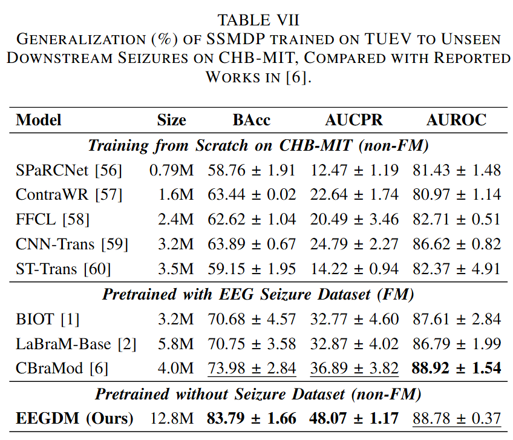
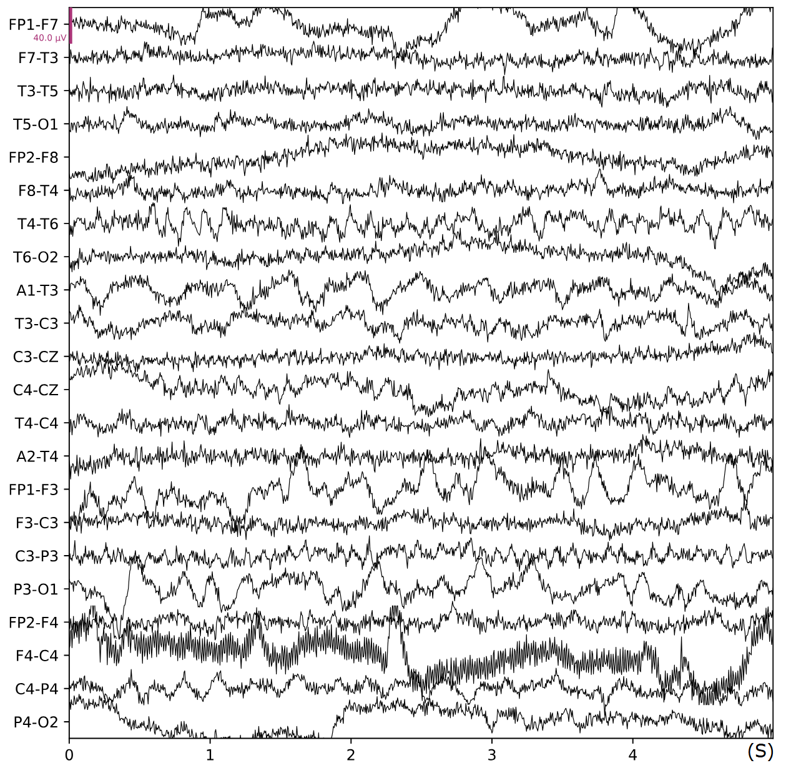

<div align="center">
<br>

<h2>EEGDM: EEG Representation Learning via Generative Diffusion Model</h2></div>

<p align="center">
  <a href="https://github.com/jhpuah/EEGDM/blob/main/EEGDM_V2.pdf">
    
  </a>
  <a href="https://huggingface.co/jhpuah/eegdm/tree/main">
    
  </a>
</p>

<h3 align="center"><a href="https://aimplifier.github.io/projects/eegdm/"> Project page here 🚀</a></h3>

<div align="center">
<br>


</div>

<div align="center">
<br>

</div>

<div align="center">
<br>

</div>


## 🌌 Introduction

Our EEGDM is a novel self-supervised diffusion model designed for superior EEG signal representation learning. Unlike traditional "tokenization-then-masking" approaches used in EEG foundation models, EEGDM leverages the power of diffusion models to achieve robust and meaningful representations through progressive noise corruption and denoising.

EEGDM is distinguished by three key innovations:

1. First Application of Diffusion Models for EEG Representation Learning: This work pioneers the use of diffusion models for extracting EEG signal representations rather than just signal generation and data augmentation, opening up a new research direction in neurological signal processing.
2. Structured State-Space Model Architecture (SSMDP): EEGDM introduces a specialized neural architecture based on structured state-space models specifically designed for diffusion pre-training, enabling better capture of the temporal dynamics inherent in EEG signals.
3. Latent Fusion Transformer for Downstream Tasks: The framework incorporates a novel latent fusion transformer (LFT) that effectively utilizes the learned diffusion representations for downstream classification tasks like seizure detection, addressing the challenge of translating generative representations to discriminative tasks.
The proposed method addresses critical limitations in current EEG analysis, including the difficulty of learning robust representations due to limited high-quality annotations and high signal variability across subjects and conditions, while potentially offering computational advantages over existing transformer-based EEG foundation models.

## 😮 Hightlights

• We presented EEGDM, a diffusion model-based framework for learning EEG signal representations and classification of multi-event EEG, extending diffusion models beyond signal generation and data augmentation.

• We developed the structured state-space model diffusion pretraining (SSMDP) to capture the temporal dynamics of EEG signals and trained it via the forward and reverse process of DDPM for representation learning.

• We proposed LFT to leverage and fuse the latent representations from SSMDP for downstream classification tasks.

• We empirically compared our method with current state-of-the-art approaches on the multi-event dataset TUEV to show its competitiveness and provided a detailed ablation study to analyze its components.

## 📈 Main result
EEGDM outperforms various EEG FMs despite the disadvantage in the volume of training data and the number of trainable parameters. On top of that, finetuning EEGDM will not update the pretrained parameters, allowing one backbone to be used in multiple downstream tasks simultaneously.

<div align="center">
<br>

</div>

## ✂️ Ablation
DDPM is a framework with many moving parts. In this section, we show that our design choices are necessary for improved performance. 

<div align="center">

</div>


<div align="center">

</div>

<br/>
Another ablation shows that the latent activities of every part of the diffusion backbones contain classification-efficient representation, and the quality tends to increase as the layers deepen.

<div align="center">

</div>

<br/>
The latent fusion module is the largest trainable component of the LFT. Here, we show that it is irreplaceable by other non-parameterized methods such as average pooling and flattening.

<div align="center">

</div>

<br>
The unique formulation of SSMDP and LFT enables the EEGDM framework to operate at a different sampling rate without retraining, at the cost of degraded performance.

<div align="center">

</div>

## 🔀 Generalize to CHB-MIT
To verify the robustness of the learned representations in cross-domain generalization, we finetuned the model on a dataset with unseen characteristics.

More specifically, the model pretrained on TUEV (containing sharp waves and artifacts) is finetuned on CHB-MIT for seizure detection.

The results show that EEGDM outperforms other FMs despite having a much smaller pretraining set that lacks variety, indicating high generalizability and robustness.

<div align="center">
<br>

</div>

## 🧠 Generation Sample

<div align="center">
<br>

</div>

## 📰 Latest Updates

*   **[2025-07-16]** Initial setup and README update.
*   **[2025-08-11]** Main pages and experiment result update.
*   **[2025-08-27]** Preprint V2.
*   **[2025-10-02]** Update README to match preprint V2.

## ⚙️ Quick Start

First, set up the environment with Conda: https://docs.conda.io/projects/conda/en/latest/user-guide/install/index.html

```bash
conda create -n eegdm python=3.11
conda activate eegdm
```
Then, install dependencies:
```bash
pip install -r requirements.txt
```
The `requirement.txt` file is exported directly from our working environment (NVIDIA GeForce RTX 4090, CUDA Version: 12.4). If your hardware is incompatible, do the following instead:

1. Install torch following the official guide: https://pytorch.org/get-started/locally/

2. Run:
```bash
pip install numpy==1.26.4 hydra-core mne lightning pyhealth ema-pytorch diffusers einops wandb scipy
```

We use Weight and Bias (https://wandb.ai/site/) for logging, and you will need an account for that. Alternatively, replace instances of `WandbLogger` with your own logger, check Pytorch Lightning documentation for available options: https://lightning.ai/docs/pytorch/stable/extensions/logging.html 


### Usage Examples:

```bash
python main.py [preprocessing=?] [pretrain=?] [cache=?] [finetune=?] [report=?] [extra=?]
```
Replace "?" with the config file name (without extension).
The file must be put inside "conf", under the directory with the same name.

e.g.
```bash
python main.py pretrain=base
```
Run pretraining with the config specified in `conf/pretrain/base.yaml`.

You can override config in the command line, 
see Hydra documentation (https://hydra.cc/docs/intro/). E.g. 
```bash
python main.py finetune=base finetune.rng_seeding.seed=10
```
Run finetuning with the config specified in `conf/finetune/base.yaml`, and set the RNG seed to 10.


`extra` config is special: the function specified in its `target` field will be loaded,
and the config will be passed to that function. This is a quick and dirty way to add experiments that do not fit well into the established workflow.

An example `extra` config:
```yaml
# Specify the script and function to load
target:
  _target_: src.util.dynamic_load
  item: src.extra.<script name>.<function name>

# Everything will be passed to the specified function
# Including the "target" field above too
config1: configcontent
config2:
  - 1
  - 2
  _ ...
```

### Experiments:
**Preprocessing:**


We follow the general preprocessing logic of LaBraM: https://github.com/935963004/LaBraM/blob/main/dataset_maker/make_TUEV.py

To produce the single-channel EEG signals for diffusion model pretraining, run:
```bash
python main.py preprocessing=pretrain
```

To produce signals for finetuning, run:
```bash
python main.py preprocessing=faithful
```

**Pre-training:**

```bash
python main.py pretrain=?
```
Where `?` is `base`, `linear` or `nolaw`.

`base` uses cosine noise scheduler and performs mu-law based extreme value suppression. `linear` uses linear noise scheduler, and `nolaw` does not perform value suppression.

**Caching:**

If noise injection is disabled, the latent tokens can be cached to avoid repeated computation. This speeds up finetuning and reduces the memory usage significantly.

The test data are untouched during caching: The model can handle cached and uncached data.

See `conf/cache` for available options. Note that the size of the cached TUEV is 94 GB, and 480 GB for CHB-MIT.
```bash
python main.py cache=base
```

**Fine-tuning:**

<!-- Use `finetune.data_is_cached=<boolean>` to tell  -->

If data is cached, the code will check the metadata to ensure that it is consistent with the model hyperparameter.

See `conf/finetune` for available options.

In our experiment, `finetune.rng_seeding.seed` is set to 0, 1, 2, 3, and 4 to produce 5 checkpoints

```bash
python main.py finetune=base finetune.rng_seeding.seed=0
```

**Reporting:**

If testing data cannot be distributed evenly across devices, certain data will be duplicated and cause inaccuracy in the reported metrics. Using `report` will avoid this issue.

`report` also calculates the mean and standard deviation of metrics of multiple checkpoints.
```bash
python main.py report=base
```

**Other Ablation**

Scripts of certain ablation experiments are put in `src/extra`:
```bash
python main.py extra=reduce_sampling extra.rate=0.95 # 200 Hz (original sampling rate) * 0.95 = 190 Hz
python main.py extra=no_fusion extra.rng_seeding.seed=0
python main.py extra=report_no_fusion
python main.py extra=mean_fusion extra.rng_seeding.seed=0
python main.py extra=report_mean_fusion
```
All seeds need to be iterated from 0 to 4

**CHB-MIT**

Using the `backbone.ckpt` pretrained on TUEV, the following commands cache and finetune EEGDM on CHB-MIT, then report the result:
```bash
python main.py cache=base_chbmit
python main.py finetune=base_chbmit_bin_filt finetune.rng_seeding.seed=0
python main.py report=base_chbmit_bin
```
All seeds need to be iterated from 0 to 4

## 🔬 Reproducibility
Pytorch does not guarantee reproducibility across different environments: https://docs.pytorch.org/docs/stable/notes/randomness.html

Regardless, we released the checkpoints trained in our environment on HuggingFace:
* `backbone.ckpt`: The single channel diffusion model trained on TUEV training set, RNG seed 0. This checkpoint allows you to skip `pretrain`, and it is not required to run `report`.

* `classifier.ckpt`: The finetuned model on TUEV for EEG event classification, RNG seed 0. This model can be used directly in `report`: 

```bash
python main.py report=base report.checkpoint=["<path to the downloaded checkpoint>"]
``` 

* `chbmit_classifier.ckpt`: The finetuned model on CHB-MIT dataset, using the `backbone.ckpt` pretrained on TUEV, RNG seed 0. This model can be used directly in `report`: 

```bash
python main.py report=base_chbmit_bin report.checkpoint=["<path to the downloaded checkpoint>"]
``` 


<!-- ## Repo Structure
`main.py` is the entry point of this repo. 

`src/` contains the scripts for generic
`src/extra/` contains the scripts of extra... 

`model/`

`dataloader/`


`conf/`

Finally, `assets` contains images used in this README file.

During pretraining and finetuning, the scripts may create new directories:
* `data/`: training, validation, and testing data, if `cache` is used, cached latent will be put under `data/cached`

* `gen/`: EEG signal samples generated by SSMDP

* `checkpoint` contains model checkpoints of SSMDP and LFT.

Others are logs by dependencies (`lightning_logs` by Pytorch Lightning, `outputs` by Hydra, etc.).  -->


## ℹ️ Unused Code
This repo is still under active development and has several pieces of unused/untested code. Any functionality implied in the code but not mentioned in the paper shall be considered experimental. Documentation about them (if any) might be outdated or unreliable.

In particular, the layerwise learning rate and weight decay for LFT will not work. Best to leave `lrd_kwargs` untouched, or set it to `null`.

## 🗺️ Roadmap
Current aim: clean up the mess by Dec 2025
* Proper documentation of class parameters and available options, add user-friendly error messages
* Refactor `model.classifier.MHAStack`: it makes calculating the depth of a layer unnecessarily complicated, hindering the implementation of layerwise learning rate decay
* Cleanup config files: most files are copy-pasted from the respective `base.yaml`, only changing one or two lines, there must be a better way
* `hydra.utils.instantiate` + `src.util.dynamic_load`: horrible
* Rename classes: `dataloader.TUEVDataset` is used for other dataset as well, `model.classifier` should be `LatentFusionTransfromer`, etc.
* Optimize the code: parallelize `cache` and `report`, optimize checkpoint size, check `TODO`s in code ...
* Remove `preprocessing` from the workflow, it should be a directory with standalone scripts, like in other FM repo
* Remove unused code

## 📖 Citation

If you use this work, please cite:

```
@misc{puah2025eegdm,
      title={{EEGDM: EEG Representation Learning via Generative Diffusion Model}}, 
      author={Jia Hong Puah and Sim Kuan Goh and Ziwei Zhang and Zixuan Ye and Chow Khuen Chan and Kheng Seang Lim and Si Lei Fong and Kok Sin Woon},
      year={2025},
      eprint={2508.14086},
      archivePrefix={arXiv},
      primaryClass={cs.LG}
}
```

## 🤝 Acknowledgments

This work is inspired by and builds upon various open-source projects and research in diffusion models and EEG processing. We acknowledge the contributions of the communities behind PyTorch, Hugging Face Diffusers, MNE-Python, and other related libraries.

## 💬 Discussion and Collaboration

We welcome discussions and collaborations to improve EEGDM. Please feel free to open issues or pull requests on GitHub.


